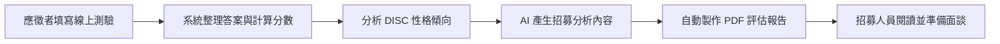

# AI 招募測驗與分析報告系統

這是一套用於招募流程的自動化測驗系統。

應徵者完成線上測驗後，系統會自動整理測驗結果、分析 DISC 性格傾向，並產生一份方便招募人員閱讀的 PDF 評估報告。

## 線上體驗

👉 [填寫招募測驗](https://forms.gle/2YW4cNU5vJwznG7WA)

> 建議使用測試姓名與虛構資料進行體驗，請勿填寫敏感個人資訊。

## 為什麼建立這套系統？

傳統招募測驗通常需要人工整理答案、計算分數、判讀性格傾向及製作面談報告。當應徵者人數增加時，不但會耗費大量時間，也容易因不同人員的判讀方式而產生差異。

這套系統將上述流程自動化，讓招募人員能更快取得格式一致的評估資料，把時間留給真正重要的面談與人才判斷。

## 系統運作流程

**填寫測驗 → 自動計分 → 性格分析 → 產生報告 → 提供面談參考**

## 測驗內容

### 邏輯能力

評估應徵者在以下方面的表現：

- 邏輯與數學理解
- 圖形邏輯判斷
- 問題分析能力

### DISC 性格傾向

透過四個面向了解應徵者可能呈現的行為風格：

- **D 型（老虎）**：重視成果、行動及挑戰
- **I 型（孔雀）**：重視互動、影響力及表達
- **S 型（無尾熊）**：重視穩定、合作及支持
- **C 型（貓頭鷹）**：重視細節、品質及準確性

DISC 分析不是將一個人簡單分類，而是協助招募人員了解其較明顯的行為傾向。

## PDF 報告內容

每位完成測驗的應徵者，都可以產生一份格式一致的 PDF 評估報告，內容包括：

- 應徵者基本資料
- 邏輯與圖形測驗分數
- DISC 四項性格分數
- 性格與行為風格重點
- 工作適配度與工作風格預測
- 提供主管參考的面談追問題目
- 錄用後可能的風險與管理建議

## 實際應用情境

- 履歷初步篩選後的測驗
- 面談前的人選資料準備
- 主管面談問題設計
- 不同人選之間的初步比較
- 錄用後的溝通與管理參考

## 系統帶來的幫助

- 減少人工計分與整理時間
- 統一每位應徵者的報告格式
- 快速產生面談追問題目
- 提供主管更完整的面談參考
- 將測驗、分析與報告整合成單一流程

## 使用提醒

本系統提供的是招募輔助資訊，不應作為錄取或淘汰應徵者的唯一依據。

實際招募決策仍應綜合考量工作經驗、專業能力、面談表現、職務需求、團隊合作方式，以及應徵者的個人意願與發展潛力。AI 產生的內容也應由招募人員或用人主管再次確認。

## 使用工具

- Google 表單
- Google 試算表
- Google 文件
- Google Apps Script
- Gemini AI

## 專案狀態

目前已完成：

- 線上測驗填寫
- 測驗結果彙整
- 邏輯與 DISC 分數整理
- AI 分析內容產生
- PDF 評估報告自動製作

---

這是一個實際運用在招募流程中的自動化專案。目標不是取代招募人員，而是減少重複工作，提供更有效率且一致的面談參考資料。
