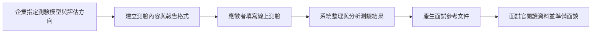

# 企業招募測驗與面試參考文件系統

這是一套可依企業需求調整的招募測驗流程。

企業可以指定想採用的測驗模型與評估方向。應徵者完成測驗後，系統會整理答案、計算結果，並產生面試參考文件，讓面試官在面談前快速掌握重點。

## 線上體驗

👉 [填寫招募測驗](https://forms.gle/2YW4cNU5vJwznG7WA)

> 建議使用測試姓名與虛構資料進行體驗，請勿填寫敏感個人資訊。

## 為什麼建立這套系統？

不同企業在意的人才條件不同，使用的測驗方式也不一定相同。傳統流程通常需要人工整理答案、計算結果及製作面談資料。當應徵者人數增加時，準備工作會占用不少時間，資料格式也可能不一致。

這套系統把測驗、資料整理與參考文件串成一個流程。企業可以按照職務需求設定評估方向，面試官則可取得格式一致的資料，用來準備後續面談。

## 系統運作流程

**指定測驗模型 → 應徵者填寫 → 整理分析 → 產生參考文件 → 面試官準備面談**

## 可依企業需求設定測驗模型

系統架構不限定單一測驗。企業可依職務與招募目的，指定要採用的測驗模型、題目內容、計分方式及報告格式。

可設定的方向例如：

- 邏輯與問題分析能力
- DISC 行為風格
- MBTI性格分類指標
- 職務能力或情境判斷
- 企業自訂的能力與特質項目

目前展示版本使用邏輯測驗與 DISC 模型。企業採用其他測驗模型時，也可以沿用相同流程，將評估結果整理成面試官容易閱讀的格式。

## 面試參考文件

完成測驗後，系統會依企業指定的格式產生參考文件。文件內容可包括：

- 應徵者基本資料與測驗結果
- 各項評估指標與重點摘要
- 面談時可進一步確認的問題
- 與職務需求相關的觀察方向
- 錄用後的溝通或管理參考

文件可輸出為 PDF，供招募人員或用人主管在面談前閱讀。內容是面試準備資料，不是由系統直接決定錄取結果。

## 實際應用情境

- 依不同職務設計適用的測驗
- 面談前整理人選資料
- 協助面試官準備追問題目
- 以一致格式查看不同人選的結果
- 作為錄用後溝通與管理的參考

## 系統帶來的幫助

- 配合企業的職務需求設定評估方式
- 減少人工計分與整理資料的時間
- 統一面試參考文件的格式
- 讓面試官提前掌握可深入了解的項目
- 將測驗、分析與文件製作整合成單一流程

## 使用提醒

本系統產生的文件是面試輔助資料，不應作為錄取或淘汰應徵者的唯一依據。

實際招募決策仍應綜合考量工作經驗、專業能力、面談表現與職務需求。系統產生的分析內容也應由招募人員或用人主管確認。

## 使用工具

- Google 表單
- Google 試算表
- Google 文件
- Google Apps Script
- Gemini AI

## 專案狀態

目前已完成：

- 線上測驗填寫
- 依企業需求設定測驗內容與評估方向(邏輯測驗、DISC、MBIT等)
- 測驗結果彙整
- AI 分析內容產生
- 面試參考文件自動製作

---

這套流程的目的不是取代面試官，而是減少整理資料的時間，讓面試官把注意力放在對話、追問與人才判斷上。
